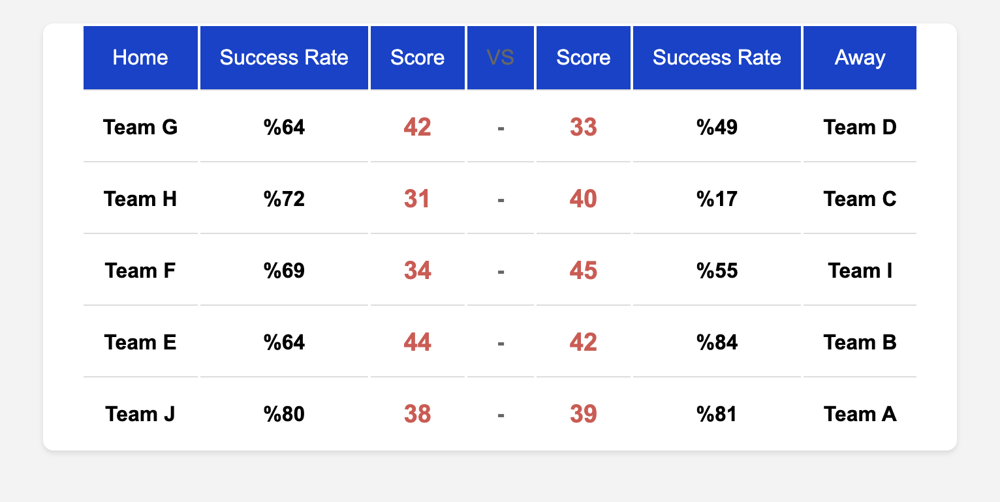
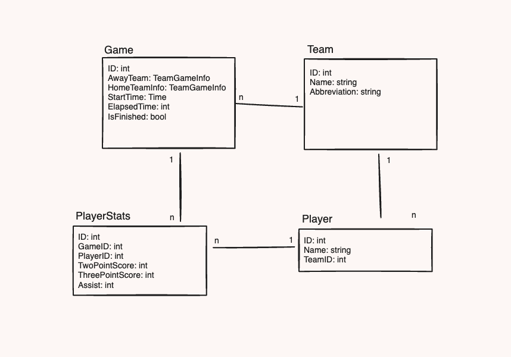

# NBA Simulator with Golang

The NBA Simulator is a Go-based application designed to simulate various aspects of NBA games. This project leverages modern software engineering practices to ensure ease of use, efficiency, and scalability.

## Features

- Docker Integration: Easy deployment and environment management using Docker.
- DDD: Domain Driven Degign

### Getting Started

These instructions will get your copy of the project up and running on your local machine for development and testing purposes.

### Prerequisites

- Go (Version 1.x or later)
- Docker (optional for containerized deployment)

### Installing

To get a development environment running, follow these simple steps:

1. Clone the repository

```
git clone https://github.com/Furkan-Gulsen/NBA-Simulator-with-Golang
```

2. Install dependencies

```
make install
```

This command will download the necessary Go modules.

### Building and Running

- Build the application

```
make build
```

This command compiles the code and creates an executable named nba_simulator.

- Run the application

```
make run
```

This will build and then run the nba_simulator.

- Development Mode

```
make dev
```

Use this for running the application in development mode with live reload.

### Docker Support

To run the application using Docker:

- Start the application

```
make up
```

This will use docker-compose to set up and start the application.

- Stop the application

```
make down
```

This will stop and remove the container set up by docker-compose.

- Cleaning Up

To clean the build artifacts and the executable:

```
make clean
```

### Links

Health Check: http://localhost:3000/ping


Link: http://localhost:3000/games

### Class Diagram


